# Wireframes

## Ecommerce

  
Store front page

  
The store front page shows a selection of 5 products from each product category. They are displayed horizontally with a scrollbar used for narrow screens. Each section has a "view all" link that will take the user to the search page and allow the user to search within that product category.

  
There is a search bar at the top allowing the user to jump to the search page with a free-text query term and/or a product type query term.

  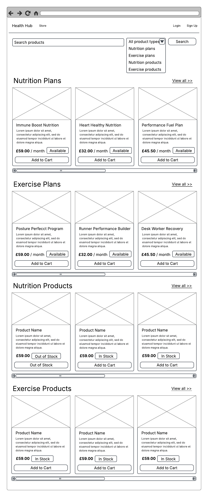

  
Store search page

  
The search page shows the same search form as the store front page, and shows similar product cards too, with the same add-to-cart functionality. The difference is in the content shown. Here the content is user-driven based on their search parameters.

  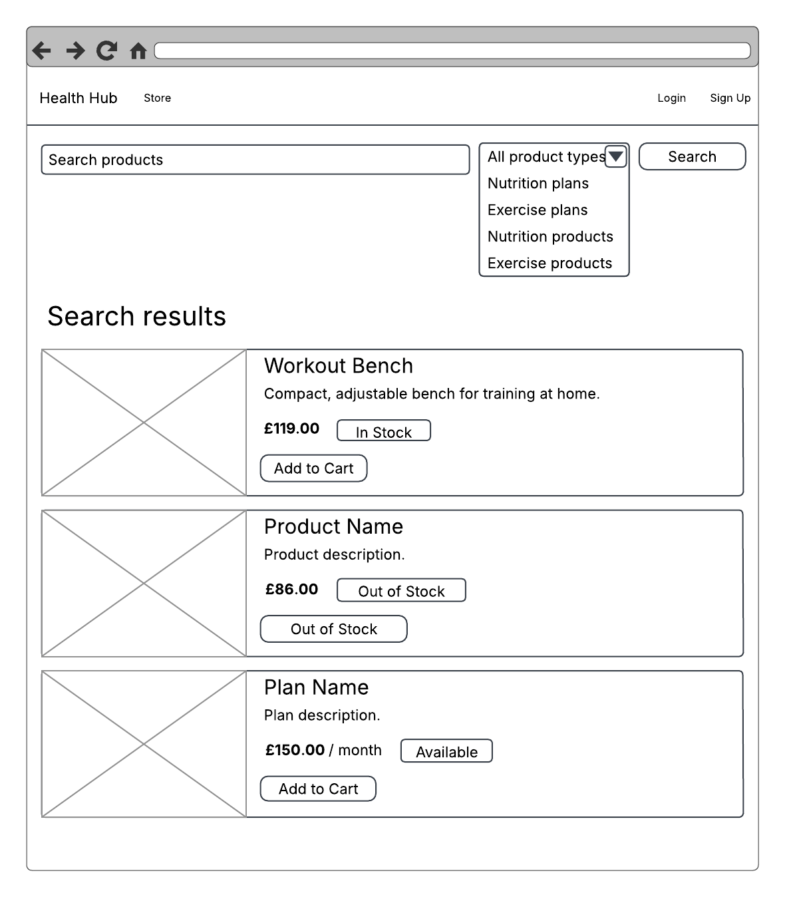
  
If there are no results the content will be a simple message.

  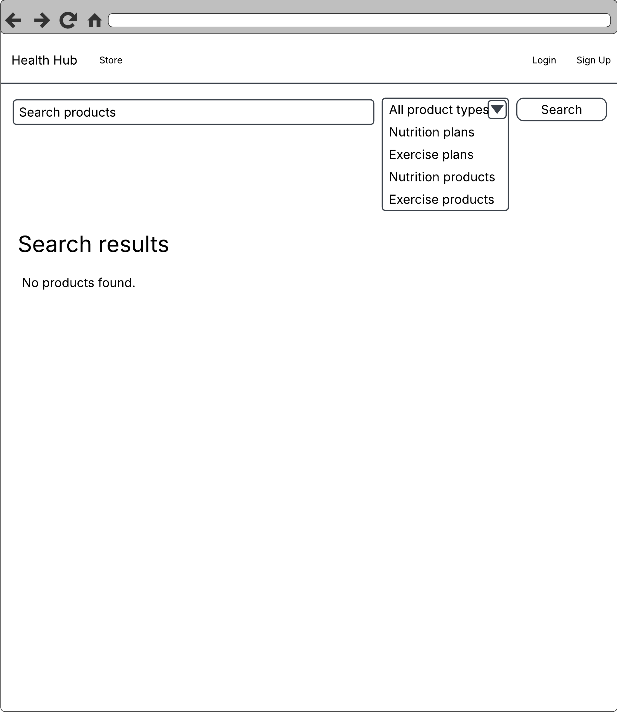

  
Cart

  
The cart page shows the content of the cart, and allows for adjusting quantity or removing any items.

  
Plan type products can only have a quantity of 1, so the - and + buttons are disabled.

  
For product type products, they have a minimum quantity of 1, and the max quantity should not be allowed to go higher than the amount in stock.

  
The total cost is displayed, and the user is presented with an option to go to the checkout.

  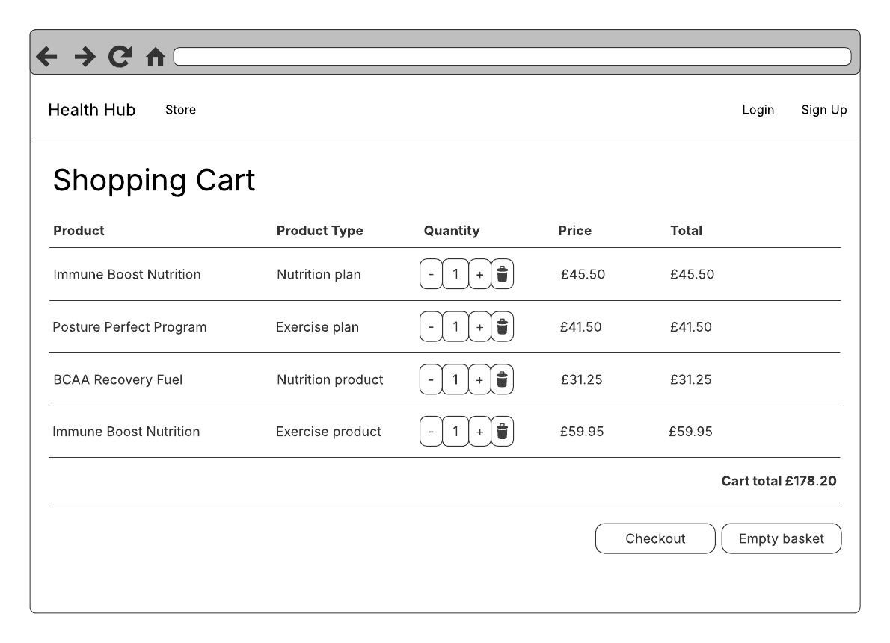
  
If the cart is empty a simple info alert will be shown.

  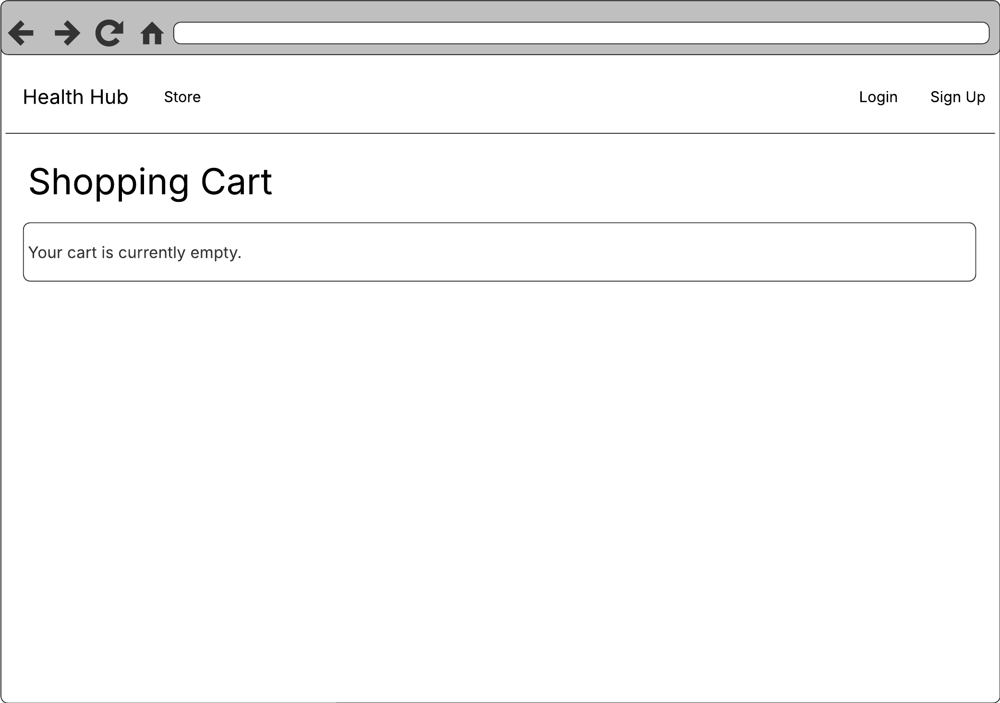

  
Checkout login

  
When the user is attempting to check out with plan type products and is unauthenticated, they must be authenticated so the plans can be associated with an account. This page will be displayed in that case to require the user to either login or create an account and then they will be redirected to the checkout page.

  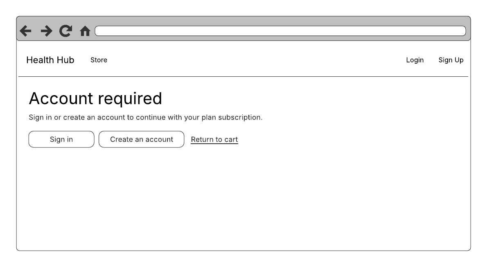

  
Checkout

  
The checkout shows a simple list of the items and prices about to be purchased, and a total.

  
The user is presented with a button to continue to pay with Stripe where they will be redirected to a Stripe page, and a link to go back to the cart to make adjustments.

  
If the user navigates to the checkout page and there are no items in the cart, the user will be redirected to the cart page.

  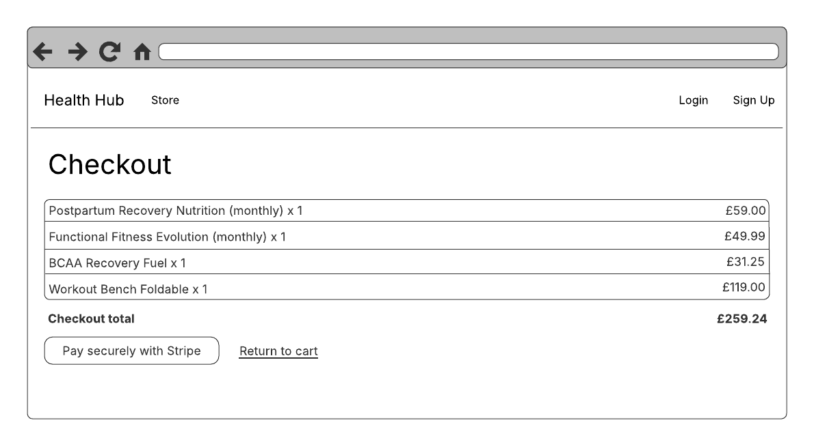
  
If the cart contains product type products (as opposed to plans) then a delivery address is required, so an input is shown for that, and is required to continue to pay.

  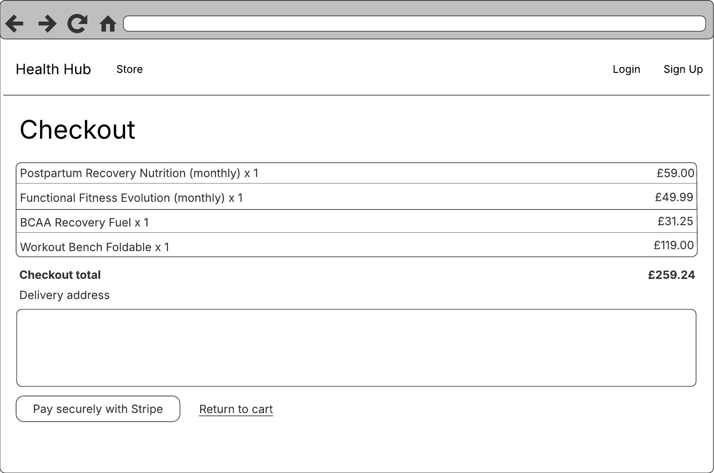

  
Payment complete

  
On successfuly payment the user will be shown a thank you message and a link to continue shopping in the store.

  

  
Payment cancelled

  
On a cancelled payment the user will be shown a message informing them their cart is still ready to be purchased again, and a link to continue shopping in the store.

  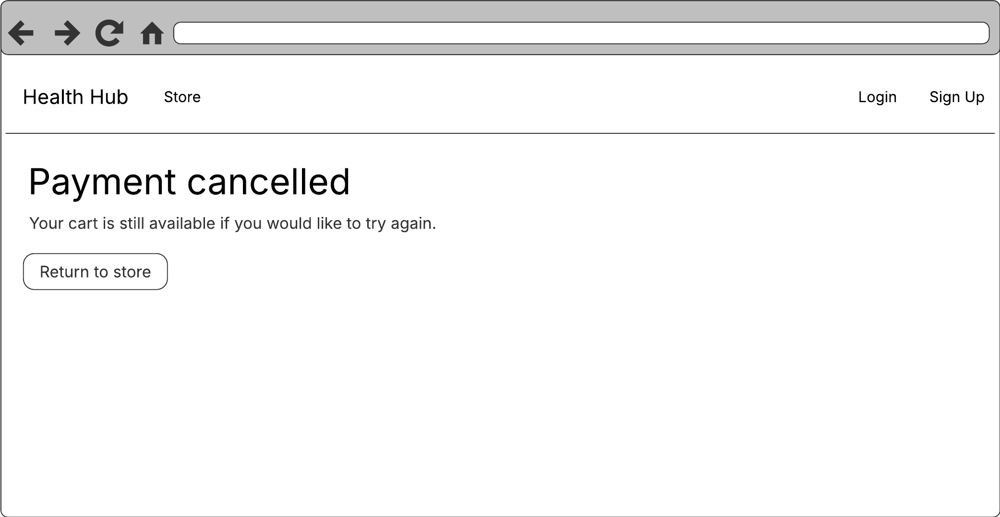

## Plans

  
Plans front page

  
This page shows a user's plans and their states, and allows the user to choose which ones are currently active.

  
It also shows a calendar which shows the events in each selected plan.

  
This is how it will appear whent he user has no subscribed plans.

  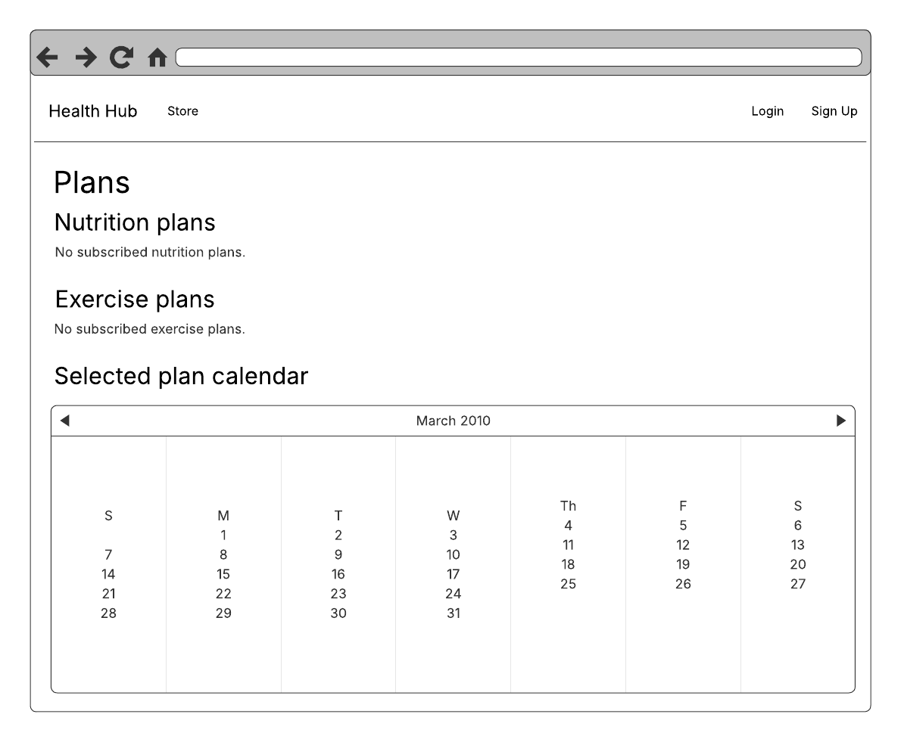
  
When the user has subscribed plans they will be shown.

  
The user can toggle plans as "current" or not with the checkboxes. When they are started they will be started on the current day. When a user is about to uncheck one, they will first be warned that this will reset their position within the plan, and must confirm their decision. Plans that are chosen will have their events shown in the calendar below. Each chosen plan will have its events shown in a unique colour. Clicking on an event will give more detail about it.

  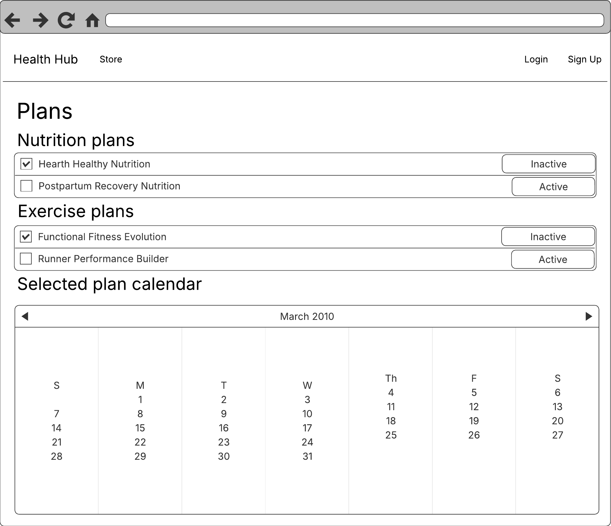

